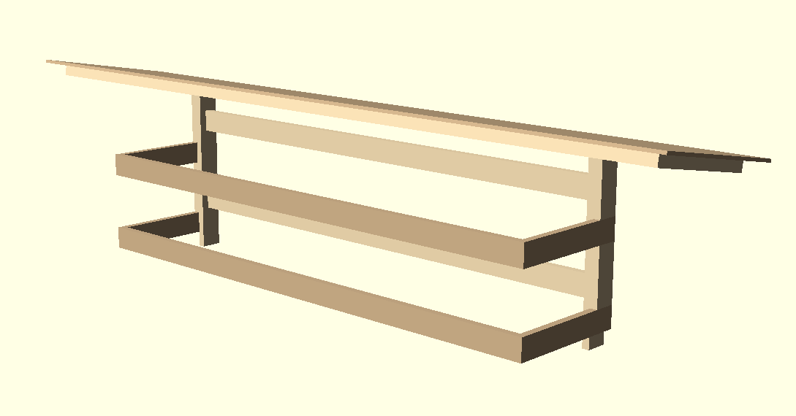

# Kayak Storage
Open kayak storage with roof

## Instuctions
1. Saw the foundation planks to length
2. Installing the concrete mounts than the lower shelf and the lower pillar stretcher.
3. Dig holes for pouring concrete. Make sure the concrete mounts on the foundation laine up with the holes.
4. Saw the pipes to length and make sure that it is level. The pipes will be different lengths.
5. Pour the concrete in to the pipes and quickly and put the foundation into the respective pipes.
6. Install the pillar filers and then the second shelf.
7. Saw the roof planks and install it.
8. Mount the roof to the foundation.
